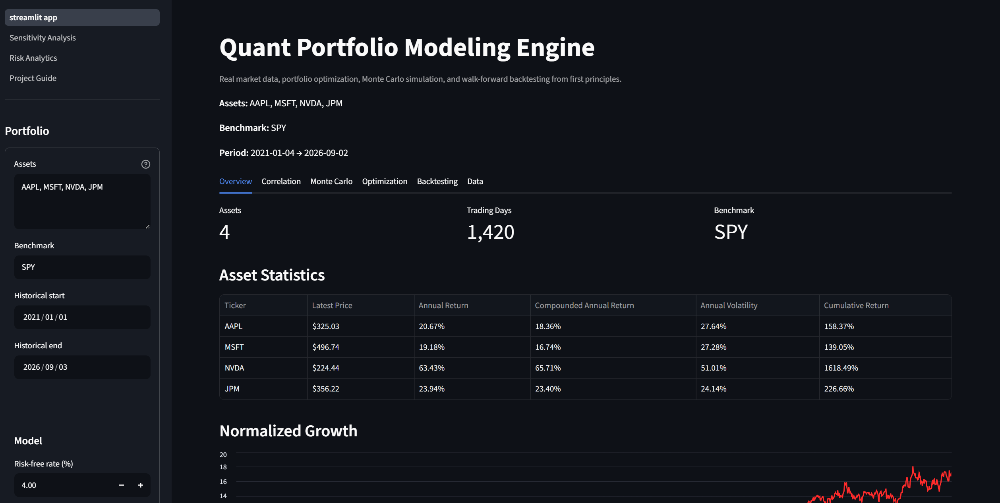
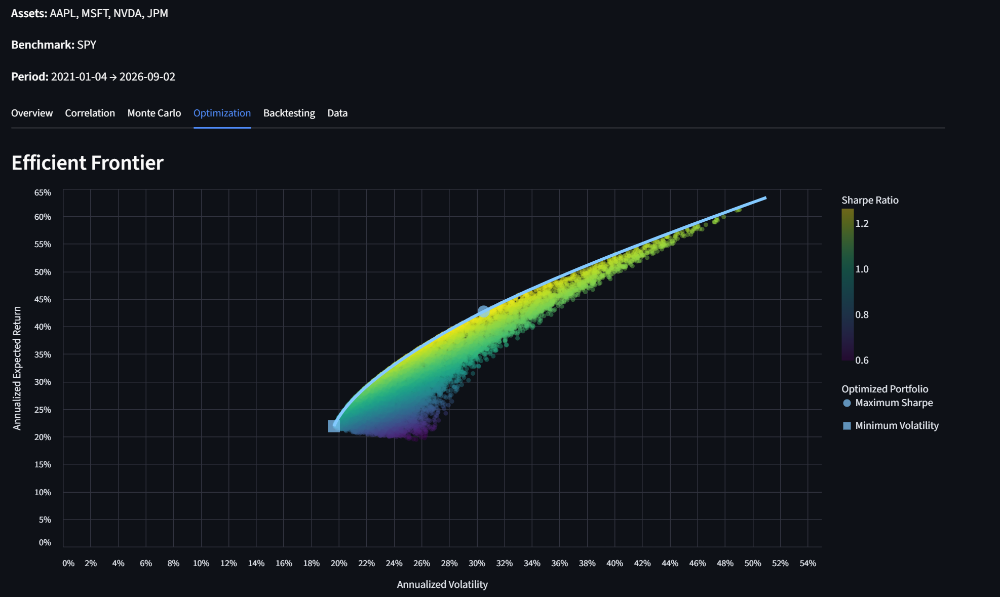
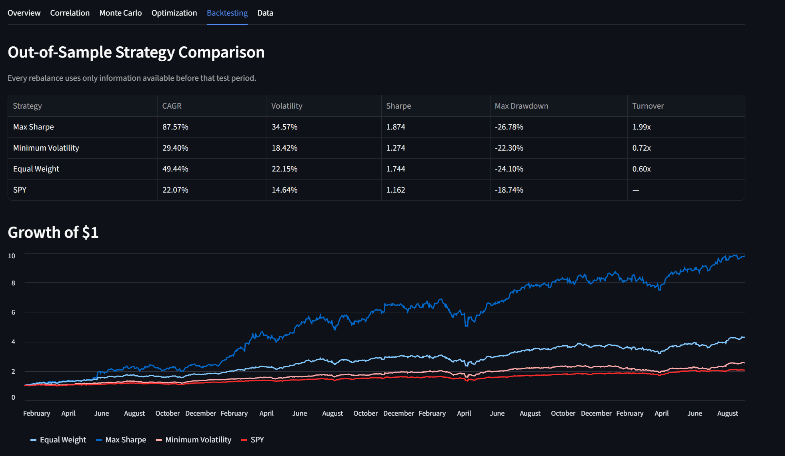

# Quant Portfolio Modeling Engine

[](https://github.com/LightFragman2/quant-portfolio-modeling-engine/actions/workflows/tests.yml)
[](https://www.python.org/)
[](https://quant-portfolio-modeling-engine.streamlit.app/)

An interactive quantitative portfolio analysis, optimization, risk-management, and backtesting engine built in Python.

The project retrieves real market data, implements core portfolio mathematics from first principles, simulates thousands of portfolios, performs constrained optimization, constructs the efficient frontier, runs walk-forward out-of-sample backtests, analyzes model sensitivity, and measures portfolio risk.

## Live Application

### [Launch the Quant Portfolio Modeling Engine](https://quant-portfolio-modeling-engine.streamlit.app/)

Users can enter their own U.S. stock or ETF tickers, configure the model, and run the analysis directly from a browser.

No local Python installation is required to use the deployed application.

---

# Screenshots

## Portfolio Dashboard



## Monte Carlo Simulation and Efficient Frontier



## Walk-Forward Backtesting



---

# Features

## Market Data

- Historical daily market prices
- Latest market prices
- User-defined U.S. stock and ETF tickers
- Custom benchmark selection
- Custom historical date range
- Alpaca Market Data API integration
- Historical data export to CSV

## Quantitative Statistics

- Simple returns
- Arithmetic mean return
- Population and sample variance
- Standard deviation
- Volatility
- Covariance
- Correlation
- Annualized arithmetic return
- Annualized volatility
- Cumulative return
- Compounded annualized return
- Sharpe ratio
- Beta
- Simple linear regression

## Portfolio Modeling

- Multi-asset expected return
- Multi-asset portfolio variance
- Portfolio volatility
- Diversification analysis
- Long-only portfolios
- Equal-weight portfolios
- Maximum position-size constraints
- Natural portfolio-weight drift

## Monte Carlo Simulation

- Thousands of randomly generated portfolios
- Expected return for every portfolio
- Volatility for every portfolio
- Sharpe ratio for every portfolio
- User-defined maximum position constraint
- Interactive risk-return visualization

## Portfolio Optimization

- Maximum-Sharpe portfolio
- Minimum-volatility portfolio
- Long-only constraints
- Maximum position-size constraints
- Target-return optimization
- Efficient frontier construction
- Monte Carlo vs. mathematical optimization comparison

## Walk-Forward Backtesting

- Trailing historical training windows
- Out-of-sample test periods
- Periodic portfolio re-optimization
- Natural weight drift between rebalances
- Transaction costs
- Portfolio turnover
- Benchmark comparison
- Maximum drawdown
- CAGR
- Annualized volatility
- Sharpe ratio
- Growth-of-$1 comparison

## Sensitivity Analysis

The application can test how strategy performance changes when varying:

- Maximum portfolio weight
- Training-window length
- Rebalance frequency
- Transaction costs

This helps identify strategies whose historical results depend too heavily on one specific set of assumptions.

## Risk Analytics

- Historical Value at Risk
- Conditional Value at Risk / Expected Shortfall
- Maximum drawdown
- Drawdown history
- Rolling volatility
- Rolling Sharpe ratio
- Return distributions
- Best historical trading days
- Worst historical trading days
- Individual asset risk analysis
- Equal-weight portfolio risk analysis

## Engineering

- pytest automated test suite
- GitHub Actions continuous integration
- Streamlit web application
- Streamlit Community Cloud deployment
- Secure API credential handling
- Cached market-data requests
- Modular Python architecture

---

# Web Application

The Streamlit interface exposes the quantitative engine through a browser.

Users can configure:

- Portfolio tickers
- Benchmark ticker
- Historical start date
- Historical end date
- Risk-free rate
- Number of Monte Carlo portfolios
- Maximum asset weight
- Backtest training window
- Rebalance frequency
- Transaction costs

The application contains dedicated views for:

- Portfolio Overview
- Correlation Analysis
- Monte Carlo Simulation
- Portfolio Optimization
- Efficient Frontier
- Walk-Forward Backtesting
- Historical Market Data
- Sensitivity Analysis
- Risk Analytics
- Project Guide

### [Open the Live Application](https://quant-portfolio-modeling-engine.streamlit.app/)

---

# Project Philosophy

A major goal of this project was to understand the mathematics behind portfolio modeling rather than treating financial libraries as a black box.

Important financial calculations are therefore implemented directly from their mathematical definitions where practical.

The overall pipeline is:

```text
Market Prices
     ↓
Returns
     ↓
Expected Return
     ↓
Variance / Volatility
     ↓
Covariance
     ↓
Correlation
     ↓
Portfolio Risk
     ↓
Diversification
     ↓
Sharpe Ratio
     ↓
Beta / Regression
     ↓
Annualization
     ↓
Monte Carlo Simulation
     ↓
Portfolio Optimization
     ↓
Efficient Frontier
     ↓
Walk-Forward Backtesting
     ↓
Sensitivity Analysis
     ↓
Risk Analytics
```

Libraries such as SciPy, pandas, NumPy, Altair, and Streamlit are used where appropriate for numerical optimization, data handling, visualization, and application infrastructure.

---

# Core Mathematics

## Simple Return

The return between two consecutive prices is:

```math
R_t
=
\frac{P_t-P_{t-1}}{P_{t-1}}
```

---

## Arithmetic Mean Return

For `n` observed returns:

```math
\bar{R}
=
\frac{1}{n}
\sum_{i=1}^{n}R_i
```

---

## Population Variance

```math
\sigma^2
=
\frac{1}{n}
\sum_{i=1}^{n}
(R_i-\bar{R})^2
```

## Sample Variance

```math
s^2
=
\frac{1}{n-1}
\sum_{i=1}^{n}
(R_i-\bar{R})^2
```

---

## Standard Deviation

```math
\sigma
=
\sqrt{\sigma^2}
```

Standard deviation of returns is used as a measure of historical volatility.

---

# Covariance

Let `C_AB` represent the covariance between assets A and B.

```math
C_{AB}
=
\frac{1}{n}
\sum_{i=1}^{n}
(R_{A,i}-\bar{R}_A)
(R_{B,i}-\bar{R}_B)
```

Positive covariance indicates that two assets historically tend to move in the same direction.

Negative covariance indicates a tendency to move in opposite directions.

---

# Correlation

Correlation standardizes covariance:

```math
\rho_{AB}
=
\frac{C_{AB}}
{\sigma_A \sigma_B}
```

with:

```math
-1
\le
\rho_{AB}
\le
1
```

Correlation is fundamental to diversification because portfolio risk depends not only on the volatility of individual assets, but also on how those assets move relative to one another.

---

# Portfolio Mathematics

## Expected Portfolio Return

For a portfolio containing `n` assets:

```math
E[R_p]
=
\sum_{i=1}^{n}
w_iE[R_i]
```

For a fully invested portfolio:

```math
\sum_{i=1}^{n}w_i
=
1
```

---

## Two-Asset Portfolio Variance

```math
\sigma_p^2
=
w_A^2\sigma_A^2
+
w_B^2\sigma_B^2
+
2w_Aw_BC_{AB}
```

Using correlation:

```math
\sigma_p^2
=
w_A^2\sigma_A^2
+
w_B^2\sigma_B^2
+
2w_Aw_B\rho_{AB}\sigma_A\sigma_B
```

The covariance term is what allows diversification to reduce portfolio risk.

---

## Multi-Asset Portfolio Variance

For multiple assets:

```math
\sigma_p^2
=
\sum_{i=1}^{n}
w_i^2\sigma_i^2
+
2
\sum_{i=1}^{n}
\sum_{j=i+1}^{n}
w_iw_jC_{ij}
```

The compact matrix representation is:

```math
\sigma_p^2
=
w^T\Sigma w
```

The project implements the expanded variance-and-covariance calculation directly.

---

## Portfolio Volatility

```math
\sigma_p
=
\sqrt{\sigma_p^2}
```

---

# Sharpe Ratio

The Sharpe ratio measures excess return per unit of volatility.

```math
S
=
\frac{R_p-R_f}
{\sigma_p}
```

where:

- `R_p` = portfolio return
- `R_f` = risk-free rate
- `sigma_p` = portfolio volatility

A higher historical Sharpe ratio indicates more excess return relative to the amount of volatility experienced.

---

# Beta

Let `C_sm` represent covariance between stock returns and market returns.

Beta is:

```math
\beta
=
\frac{C_{sm}}
{\sigma_m^2}
```

A beta above 1 indicates greater historical sensitivity to market movements.

A beta below 1 indicates lower historical sensitivity.

---

# Simple Linear Regression

The project implements:

```math
Y
=
\alpha
+
\beta X
+
\epsilon
```

The slope is:

```math
\beta
=
\frac{C_{XY}}
{\sigma_X^2}
```

The intercept is:

```math
\alpha
=
\bar{Y}
-
\beta\bar{X}
```

This is used to analyze an asset's historical relationship with a market benchmark.

---

# Annualization

The engine uses approximately 252 trading days per year for daily market data.

## Arithmetic Annualized Return

```math
R_a
\approx
252\bar{R}_d
```

## Annualized Volatility

```math
\sigma_a
=
\sigma_d
\sqrt{252}
```

## Cumulative Return

```math
R_c
=
\left[
\prod_{t=1}^{n}
(1+R_t)
\right]
-1
```

## Compounded Annualized Return

```math
R_a
=
\left(
\prod_{t=1}^{n}
(1+R_t)
\right)^{252/n}
-1
```

---

# Monte Carlo Simulation

Monte Carlo simulation explores many possible portfolio allocations.

For a long-only portfolio:

```math
w_i
\ge
0
```

For a fully invested portfolio:

```math
\sum_iw_i
=
1
```

For each sampled portfolio, the engine calculates:

- Expected annual return
- Annualized volatility
- Sharpe ratio
- Portfolio weights

The simulation produces a cloud of possible historical risk-return combinations.

Monte Carlo simulation samples the portfolio space.

It does **not** prove that the best sampled portfolio is mathematically optimal.

The optimization engine separately solves for specific portfolio objectives.

---

# Portfolio Optimization

The optimization engine uses SciPy's SLSQP numerical optimizer while the portfolio statistics themselves are calculated using the project's own functions.

## Minimum-Volatility Portfolio

The objective is:

```math
\min_w
\sigma_p^2
```

subject to:

```math
\sum_iw_i
=
1
```

and:

```math
0
\le
w_i
\le
w_{\max}
```

---

## Maximum-Sharpe Portfolio

The objective is:

```math
\max_w
\frac{E[R_p]-R_f}
{\sigma_p}
```

Because numerical optimization software generally minimizes objective functions, the implementation minimizes:

```math
-S
```

which is equivalent to maximizing the Sharpe ratio.

---

# Efficient Frontier

For a series of target returns, the engine solves for the minimum-risk portfolio capable of reaching each target.

The optimization objective is:

```math
\min_w
\sigma_p^2
```

subject to a target expected return:

```math
E[R_p]
=
R^*
```

and the portfolio constraints:

```math
\sum_iw_i
=
1
```

```math
0
\le
w_i
\le
w_{\max}
```

The resulting portfolios form the efficient frontier.

A portfolio below the frontier is inefficient because another portfolio can provide either:

- more expected return for approximately the same risk, or
- less risk for approximately the same expected return.

---

# Walk-Forward Backtesting

A major focus of the project is preventing look-ahead bias.

The backtesting process is:

```text
Historical Training Window
          ↓
Estimate Historical Statistics
          ↓
Optimize Portfolio
          ↓
Lock Portfolio Weights
          ↓
Future Out-of-Sample Period
          ↓
Observe Actual Returns
          ↓
Allow Weights to Drift
          ↓
Rebalance
          ↓
Repeat
```

A typical configuration is:

```text
Training window:        504 trading days
Rebalance frequency:     63 trading days
```

This approximates:

- Two years of trailing training data
- Quarterly portfolio rebalancing

At every rebalance date, only information available before that date is used to determine the portfolio allocation for the next testing period.

---

# Natural Portfolio Weight Drift

Portfolio weights are not artificially reset every day.

Suppose a portfolio starts as:

```text
Asset A: 50%
Asset B: 50%
```

If Asset A subsequently outperforms Asset B, Asset A naturally becomes a larger percentage of the portfolio.

The engine allows these weights to drift until the next scheduled rebalance.

---

# Portfolio Turnover

Let `T` represent one-way portfolio turnover.

```math
T
=
\frac{1}{2}
\sum_i
\left|
w_{i,new}
-
w_{i,old}
\right|
```

For example, moving from:

```text
Asset A: 50%
Asset B: 50%
```

to:

```text
Asset A: 100%
Asset B: 0%
```

creates 50% one-way portfolio turnover.

---

# Transaction Costs

Let:

- `T` = portfolio turnover
- `b` = transaction cost in basis points
- `C` = estimated transaction-cost rate

Then:

```math
C
=
T
\frac{b}{10000}
```

This prevents the backtest from assuming that portfolio rebalancing is completely free.

The transaction-cost model is intentionally simplified.

---

# Maximum Position Constraints

The optimizer supports maximum position sizes.

For example, a 40% concentration cap requires:

```math
0
\le
w_i
\le
0.40
```

This allows direct comparison between:

```text
Unrestricted Maximum Sharpe
          vs.
Maximum Sharpe with Position Cap
```

Concentration limits help show how diversification constraints affect return, volatility, drawdown, and risk-adjusted performance.

---

# Maximum Drawdown

Let `V_t` represent portfolio value and `P_t` represent the highest portfolio value observed up to time `t`.

Drawdown is:

```math
D_t
=
\frac{V_t}{P_t}
-1
```

Maximum drawdown is the largest historical peak-to-trough decline.

---

# Sensitivity Analysis

A strong historical result can be misleading if it only works with one exact parameter setting.

The sensitivity-analysis engine changes one assumption at a time while keeping the others constant.

Supported sensitivity variables include:

### Maximum Position Size

Example:

```text
25%
40%
60%
80%
100%
```

This tests whether strong performance depends on extreme portfolio concentration.

### Training Window

Example:

```text
252 days
378 days
504 days
756 days
```

This tests whether performance depends heavily on one specific historical lookback period.

### Rebalance Frequency

Example:

```text
21 days
63 days
126 days
252 days
```

This tests whether the strategy depends heavily on specific trading timing.

### Transaction Costs

Example:

```text
0 bps
5 bps
10 bps
25 bps
50 bps
```

This tests whether realistic trading friction materially changes the result.

A more robust strategy should generally respond gradually to reasonable parameter changes rather than collapsing when a single assumption changes slightly.

---

# Risk Analytics

## Historical Value at Risk

Historical VaR estimates a loss threshold using the empirical return distribution.

For example, a 95% daily VaR of 3% means that approximately 5% of the observed historical daily returns were worse than a 3% loss.

VaR describes a historical threshold.

It does not describe how severe losses can become once that threshold is exceeded.

---

## Conditional Value at Risk

Conditional Value at Risk, also called Expected Shortfall, measures the average loss among observations beyond the VaR threshold.

This provides information about the severity of historical tail losses.

---

## Rolling Volatility

Rolling volatility recalculates annualized volatility across moving historical windows.

This makes it possible to observe how portfolio risk changes across different market regimes.

---

## Rolling Sharpe Ratio

Rolling Sharpe analysis measures how historical risk-adjusted performance changes through time.

A strategy with a strong full-period Sharpe ratio may still experience long periods of weak or negative risk-adjusted performance.

---

## Return Distribution

The application includes a historical return histogram to visualize:

- Typical daily returns
- Large positive moves
- Large negative moves
- Tail behavior
- Return dispersion

---

## Extreme Trading Days

The risk dashboard identifies:

- 10 worst historical days
- 10 best historical days

This helps show how much overall performance and risk can be influenced by relatively rare market events.

---

# Strategy Comparison

The backtesting engine can compare:

- Maximum Sharpe
- Maximum Sharpe with a concentration cap
- Minimum Volatility
- Equal Weight
- Market benchmark

Strategies are evaluated with:

| Metric | Purpose |
|---|---|
| CAGR | Compounded annual portfolio growth |
| Volatility | Historical variability of returns |
| Sharpe Ratio | Excess return per unit of volatility |
| Maximum Drawdown | Largest historical peak-to-trough decline |
| Turnover | Amount of portfolio reallocation |
| Transaction Costs | Estimated cost of rebalancing |

---

# Architecture

```text
                    Streamlit Web Application
                              |
                              v
                       User Parameters
                              |
              +---------------+---------------+
              |                               |
              v                               v
        Asset Universe                  Model Settings
              |                               |
              +---------------+---------------+
                              |
                              v
                      Alpaca Market Data
                              |
                              v
                    Historical Price Data
                              |
                              v
                  First-Principles Engine
                              |
       +----------------------+----------------------+
       |                      |                      |
       v                      v                      v
   Statistics           Portfolio Math        Regression / Beta
       |                      |                      |
       +----------------------+----------------------+
                              |
                              v
                       Monte Carlo
                              |
                              v
                       Optimization
                              |
                              v
                    Efficient Frontier
                              |
                              v
                 Walk-Forward Backtesting
                              |
                 +------------+------------+
                 |                         |
                 v                         v
        Sensitivity Analysis        Risk Analytics
                 |                         |
                 +------------+------------+
                              |
                              v
                Interactive Streamlit Results
```

---

# Project Structure

```text
quant-portfolio-modeling-engine/
│
├── assets/
│   ├── dashboard.png
│   ├── efficient-frontier.png
│   └── backtest.png
│
├── pages/
│   ├── 1_Sensitivity_Analysis.py
│   ├── 2_Risk_Analytics.py
│   └── 3_Project_Guide.py
│
├── src/
│   ├── __init__.py
│   ├── annualization.py
│   ├── backtesting.py
│   ├── backtest_visualization.py
│   ├── input_validation.py
│   ├── market_data.py
│   ├── monte_carlo.py
│   ├── optimization.py
│   ├── portfolio.py
│   ├── regression.py
│   ├── returns.py
│   ├── risk.py
│   ├── sensitivity.py
│   ├── statistics.py
│   └── visualization.py
│
├── scripts/
│   ├── __init__.py
│   └── run_robustness_backtest.py
│
├── tests/
│
├── .github/
│   └── workflows/
│       └── tests.yml
│
├── .streamlit/
│   └── config.toml
│
├── streamlit_app.py
├── main.py
├── requirements.txt
├── .env.example
├── .gitignore
└── README.md
```

---

# Technology Stack

## Language

- Python

## Quantitative Computing

- SciPy
- NumPy
- pandas

## Visualization

- Altair
- Matplotlib
- Streamlit

## Market Data

- Alpaca Market Data API

## Testing and Engineering

- pytest
- Git
- GitHub
- GitHub Actions

## Deployment

- Streamlit Community Cloud

---

# Running Locally

## 1. Clone the Repository

```bash
git clone https://github.com/LightFragman2/quant-portfolio-modeling-engine.git
```

Move into the project:

```bash
cd quant-portfolio-modeling-engine
```

## 2. Create a Virtual Environment

```bash
python -m venv .venv
```

On Windows PowerShell:

```powershell
.\.venv\Scripts\Activate.ps1
```

## 3. Install Dependencies

```bash
python -m pip install -r requirements.txt
```

## 4. Configure Alpaca Credentials

Create a `.env` file in the project root:

```text
ALPACA_API_KEY=your_api_key
ALPACA_SECRET_KEY=your_secret_key
```

Do not commit this file.

The repository includes `.env.example` as a safe template.

## 5. Launch the Application

```bash
python -m streamlit run streamlit_app.py
```

The application will normally be available at:

```text
http://localhost:8501
```

---

# Running the Test Suite

Run:

```bash
python -m pytest
```

The automated tests cover major components including:

- Return calculations
- Arithmetic mean
- Variance
- Standard deviation
- Covariance
- Correlation
- Portfolio expected return
- Portfolio variance
- Portfolio volatility
- Sharpe ratio
- Beta
- Regression
- Annualization
- Cumulative returns
- Monte Carlo weight generation
- Monte Carlo simulation
- Maximum position constraints
- Mathematical optimization
- Efficient frontier
- Walk-forward backtesting
- Maximum drawdown
- Natural weight drift
- Portfolio turnover
- Transaction costs
- Ticker input validation
- Sensitivity analysis
- Historical quantiles
- Value at Risk
- Conditional Value at Risk
- Rolling volatility
- Rolling Sharpe ratio
- Equal-weight risk calculations

---

# Continuous Integration

GitHub Actions automatically runs the test suite when changes are pushed to the main branch or included in a pull request.

```text
Code Push
   ↓
GitHub Actions
   ↓
Create Python Environment
   ↓
Install Dependencies
   ↓
Run pytest
   ↓
Pass / Fail
```

This helps prevent new changes from silently breaking previously working quantitative functionality.

---

# Security

Alpaca API credentials are never committed to the repository.

Local development uses:

```text
.env
```

The deployed application stores credentials using Streamlit's secrets system.

Secret-containing files are excluded through `.gitignore`.

The application retrieves market data but does not place trading orders.

---

# Important Limitations

This project is an educational and research-oriented quantitative-finance application.

Historical results should not be interpreted as predictions of future performance.

Important limitations include:

- Historical performance does not guarantee future performance.
- Expected returns are estimated from historical observations.
- Historical volatility may not represent future volatility.
- Historical covariance and correlation relationships may change.
- Portfolio optimization is highly sensitive to expected-return estimates.
- Optimizers may produce concentrated portfolios.
- Asset selection can introduce selection bias.
- Survivorship bias can affect historical analysis.
- Backtest performance depends heavily on the selected historical period.
- Sensitivity testing improves robustness analysis but cannot eliminate model risk.
- Transaction-cost modeling is simplified.
- Taxes are not modeled.
- Bid-ask spreads are not modeled directly.
- Market impact is not modeled.
- Liquidity constraints are not modeled.
- Historical risk-free rates are not yet dynamically incorporated.
- Historical VaR and CVaR do not guarantee future loss limits.
- Free market-data feeds may differ from consolidated institutional-grade market data.
- The current application primarily targets long-only U.S. stocks and ETFs.
- Strong historical performance does not prove that a strategy will perform similarly in the future.

These limitations are part of the reason the project includes:

- Out-of-sample testing
- Benchmark comparisons
- Position constraints
- Transaction costs
- Portfolio turnover
- Sensitivity analysis
- Drawdown analysis
- Tail-risk analytics
- Multiple competing portfolio strategies

---

# Future Development

Potential future extensions include:

- Historical Treasury risk-free rates
- Alternative expected-return estimators
- Additional portfolio constraints
- Larger asset universes
- Additional benchmarks
- CAPM analysis
- Alpha decomposition
- R-squared analysis
- Multi-factor models
- Fama-French factor analysis
- More advanced transaction-cost modeling
- Liquidity modeling
- Rebalancing optimization
- Additional tail-risk models
- Stress testing
- Scenario analysis

---

# Why I Built This

Many quantitative-finance projects can produce sophisticated-looking results while hiding most of the mathematics behind libraries.

I wanted to build the opposite.

The objective was to understand how the quantitative ideas connect, implement the core calculations directly, and then build increasingly realistic portfolio tools on top of those foundations.

The project evolved from basic return calculations into a complete interactive application covering:

```text
Market Data
     ↓
Statistical Analysis
     ↓
Portfolio Mathematics
     ↓
Diversification
     ↓
Monte Carlo Simulation
     ↓
Portfolio Optimization
     ↓
Efficient Frontier
     ↓
Walk-Forward Backtesting
     ↓
Transaction Costs
     ↓
Sensitivity Testing
     ↓
Risk Analytics
     ↓
Interactive Web Application
```

The result is a project where both the code and the quantitative reasoning behind it can be explained.

---

# Live Application

## [Open the Quant Portfolio Modeling Engine](https://quant-portfolio-modeling-engine.streamlit.app/)

## [View the GitHub Repository](https://github.com/LightFragman2/quant-portfolio-modeling-engine)

---

# Disclaimer

This project is for educational and research purposes only.

Nothing generated by this application should be interpreted as financial advice, an investment recommendation, or a guarantee of future performance.